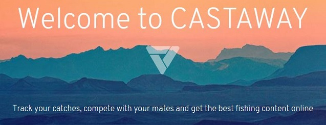

[Click here](http://castawayapp.tech) to open **CASTAWAY.**

#### WHAT IS CASTAWAY 
CASTAWAY is a web application created out of passion for fishing. We enable anglers from all around the world to keep track of their fishing successes, analyze weather conditions and compete with others.

#### HOW IT WORKS  
CASTAWAY gives you a few handy features that are aimed at serving you both a pleasurable and useful experience. All of them are available for registered users. Don't want to register before you try everything out? No problem - use the credentials listed in the *About* section of the app to log in.

Here is what you can do:

* **TRACK YOUR CATCHES**  
Keep record of all your catches. Your mandatory input is merely the species, length, weight and date. Based on that CASTAWAY will get all the weather information for that day that you can use for future analysis. The way it works is that the application sends a request to an external weather service. The response is then trimmed to give you all you need without any irrelevant data and stored in a database.

* **COMPETE WITH OTHERS**  
See how your fishing results compare to other users of CASTAWAY. By entering the 'Rank' page, you trigger the application's algorithm to calculate the number of points awarded to each user. The points are not stored in a database, instead they are calculated at runtime based on each species' attributes and your catches' measurements. This solution enables CASTAWAY to have the point counting algorithm beta tested by the users and have it improved based on your suggestions without affecting the existing records.
CASTAWAY is also working on a new feature called 'Competition'. It will enable you to create your own tournament for you and your mates, which noone else will have access to. You will be able to set the ending date and parameterize the competition to your needs. It's summer and you wish to challenge your friends to a catfish battle? No problem - set the competition so that only catfish of legal size are eligible for the final rank. Stay tuned for this feature's release!

* **ANALYZE YOUR RECORDS**  
Each catch saved by you triggers a request to an external weather service to get all the records you need for your analysis. The weather API responds with a set of JSON records, which are then trimmed to save only the conditions valid for fishing. The way it currently works is that the requests are parameterized with Warsaw as a default location. You will soon be able to define the precise location yourself.

Another feature that CASTAWAY is working on is 'Stats'. As both CASTAWAY and your record sheet grows, you will be able to retrieve a statistical summary of your records. Ever wondered how the air pressure contributes to your fishing success? Well, soon enough you will be able to empirically see it for yourself. All you will have to do is choose air pressure as a parameter and you will get a nice graph of all your catches compared against it. Stay tuned for this feature's release!

#### TECH STACK
Here is what's behind the scenes:

- JAVA 11
- SpringBoot
- Spring Security
- Hibernate
- Jackson
- Maven
- Bootstrap (HTML, CSS, JavaScript)
- OkHttp3
- BCrypt
- JavaMail
- OAuth2
